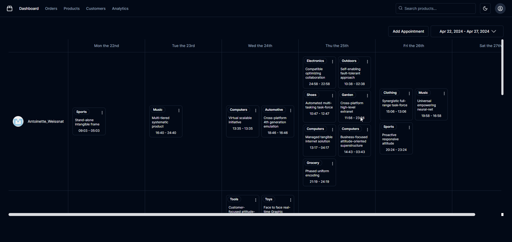

# Planner

Planner is a highly adaptable scheduling component tailored for React applications. This tool enriches your application with robust resource management functionalities. Planner integrates smoothly into your existing systems, presenting intuitive interfaces for effective management of appointments and resources. By embodying the principles of shadcn/ui, Planner emphasizes component reusability and adaptability, offering a modular approach to UI construction.



## Features

- **Dynamic Scheduling**: Equip your application with a powerful component to manage and visualize appointments effectively across various timelines including daily, weekly, monthly, and yearly views.
- **Resource Management**: Easily assign and track essential resources such as rooms or personnel associated with specific appointments.
- **Drag and Drop**: Simplify appointment adjustments and resource allocations with an intuitive drag-and-drop interface, powered by Atlassian's Pragmatic drag and drop.
- **Customizable UI**: Utilize the flexible `shadcn/ui` components to ensure that Planner fits perfectly within your application's design.

## Project Structure

```plaintext
/src
|-- /utils
|   └── fakeData.ts                   # Utilities to generate fake data
|-- /styles
|   └── globals.css                   # Global styles
|-- /services
|   ├── AppointmentService.ts         # Manages appointment CRUD operations
|   ├── index.ts                      # Service exports
|   └── ResourceService.ts            # Manages resource CRUD operations
|-- /models
|   ├── Appointment.ts                # Appointment data model
|   ├── index.ts                      # Model exports
|   └── Resource.ts                   # Resource data model
|-- /lib
|   └── utils.ts                      # Additional utility functions
|-- /contexts
|   ├── CalendarDataContext.tsx       # Context for managing Planner data
|   └── PlannerContext.tsx            # Context for managing overall app state
|-- /components
|   ├── ui                            # UI components following `shadcn/ui` philosophy
|   └── planner                       # Planner-specific components
└── /app
    ├── layout.tsx                    # Main layout component
    └── page.tsx                      # Entry page component
```

## Getting Started

To start using Planner in your project, follow these steps to install and configure the necessary components:

### Steps to Install

1. Copy the contents from the `/components/planner` directory.
2. Include the model files from the `/models` directory.
3. Integrate contexts from the `/contexts` directory for state management.
4. Utilize services from the `/services` directory to handle business logic.
5. Merge the utility functions from `/lib/utils.ts` into your project's utility functions.

### Additional Dependencies

Ensure to include the following dependencies in your project:

- `react-day-picker` for date picking functionalities.
- `date-fns` for handling date operations.
- `@atlaskit/pragmatic-drag-and-drop` for implementing the drag and drop features.

### Style Integration

Add the following styles to your global stylesheet to ensure the calendar components display correctly:

```css
/* Scrollbar customization for calendar components */
.calendar-scroll::-webkit-scrollbar {
  width: 8px;
  scrollbar-width: thin;
}
.calendar-scroll::-webkit-scrollbar-track {
  background: var(--background);
}
.calendar-scroll::-webkit-scrollbar-track:hover {
  background: var(--muted);
}
.calendar-scroll::-webkit-scrollbar-thumb {
  background: #DADCE0;
  border-radius: 6px;
  cursor: grab;
}
.calendar-scroll::-webkit-scrollbar-thumb:hover {
  background: #BDC1C6;
}
.calendar-scroll::-webkit-scrollbar-thumb:active {
  cursor: grabbing;
}
```

## Credits

Special thanks to the following projects and their teams for inspiration and tools that helped enhance Planner:

- **shadcn/ui**: For the philosophy of reusable components. [Visit shadcn/ui](https://github.com/shadcn/ui)
- **openstatus**: For the innovative time picker component. [openstatus time picker](https://time.openstatus.dev/#time-picker-demo.tsx)
- **date-range-picker-for-shadcn**: For the tailored date range picker. [Visit date-range-picker-for-shadcn](https://github.com/johnpolacek/date-range-picker-for-shadcn/tree/main)
- **Atlassian**: For the groundbreaking Pragmatic drag and drop library. [Atlassian Pragmatic Drag and Drop](https://atlassian.github.io/pragmatic-drag-and-drop/)

## Demo

Experience Planner in action: [Planner Demo](https://planner-tau-two.vercel.app/)

## Contributing

We welcome contributions to Planner! Whether it's feature enhancements, bug fixes, or documentation improvements, follow these steps:

1. Fork the repository.
2. Create a new branch (`git checkout -b feature/your-feature`).
3. Commit your changes (`git commit -am 'Add some feature'`).
4. Push to the branch (`git push origin feature/your-feature`).
5. Open a new Pull Request.

Let's make Planner even better together!